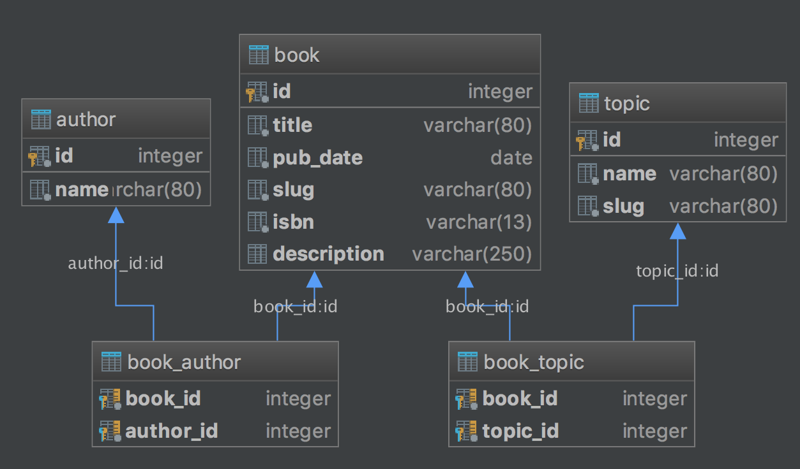

# Udacity: Bookshelf

This repo is part of Udacity's nd004 course.

An application to add, edit, and delete books by topics. User authentication
provided by Github.

## Kudos

- Project would have been much harder without those awesome packages:
    - [WTForms](https://github.com/wtforms/wtforms/)
    - [Flask-Bootstrap](https://github.com/mbr/flask-bootstrap)
    - [Github-Flask](https://github.com/cenkalti/github-flask)

## What

- Simple CRUD application to browse and edit a bookshelf
- SQLite database is prefilled with `vagrant/data/books.json`
- Using human-friendly slugs instead of ids for URLs; examples:
    - `/python/learning-python`
    - `machine-learning/introduction-to-machine-learning`
- Unauthenticated users can browse all topics and books
- Authenticated users can also edit and delete topics and books as well as add
new books
    - Hint: in forms, authors and books are provided as a comma separated
    string (Usability is not the best, but it serves its purpose)
    - Edit and add books will add and delete authors and books if necessary
- Authentication provided by Github
- JSON endpoints for all books `/JSON` and by topic `topic-slug/JSON`
    - No authentication for JSON endpoints required
- Forms validation done by [WTForms](https://github.com/wtforms/wtforms/)
- Forms are CSRF-proof by [Flask-WTF](https://github.com/lepture/flask-wtf)

## Setup Github OAuth

- Go to [Github dev settings](https://github.com/settings/developers)
- Register new app
- Set homepage URL to `http://localhost:5000`
- Set callback URL to `http://localhost:5000/github-callback`
- Create the app
- Copy client id to `GITHUB_CLIENT_ID` in [vagrant/src/github_secrets.py](vagrant/src/github_secrets.py#L12)
- Copy client id to `GITHUB_CLIENT_SECRET` in [vagrant/src/github_secrets.py](vagrant/src/github_secrets.py#L13)

## Run Vagrant

- `cd` into `vagrant` folder
- `vagrant up`
    - [Vagrant will create the SQLite database](vagrant/Vagrantfile#L21)
    - [Vagrant will prefill the database with values](vagrant/Vagrantfile#L22)
- `vagrant ssh` into the VM
- `python3 /vagrant/src/app.py` to start Flask server

## Database diagram

Since books can have multiple topics and multiple authors, junction tables are
used to create references between topics and books and books and authors. Here
is a simple diagram.

